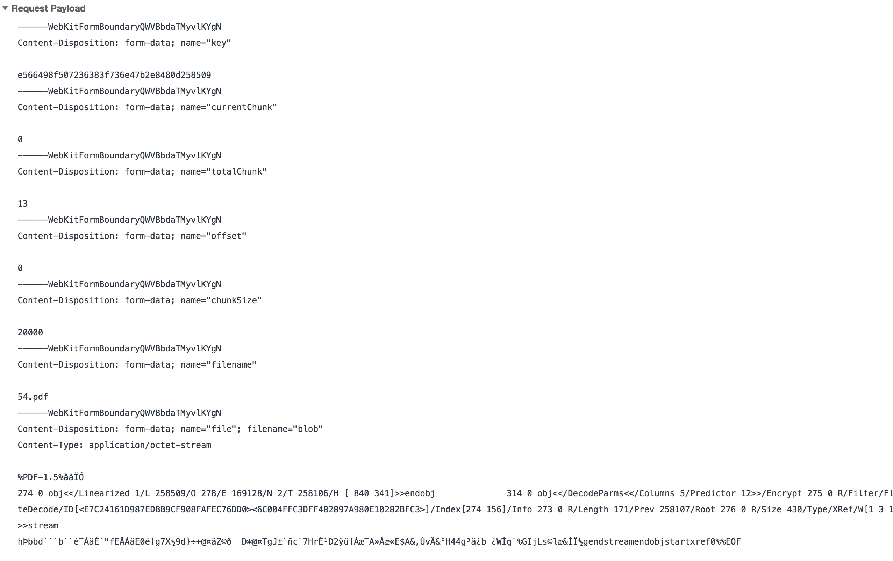

Slice file upload server.

> A file upload server, use Node.js & Lowdb.

# Run

``` bash
# install package.
$ npm install

# run server
$ node ./server.js

# And then, use http://xxxxxx.xxxx.xx:6677/upload (in config.js) as your upload api.
```

# Upload Api Params

name | type | required | note |
------ | ----- | ----- | ----- |
key | string | true | file md5 string or other primary key |
currentChunk | string/number | true | current chunk (start with 0) |
totalChunk | string/number | true | total chunk number |
offset | string/number | false | offset of file |
chunkSize | string/number | true | chunk size |
filename | string | true | original filename |
file | blob | true | file blob |

# Example


